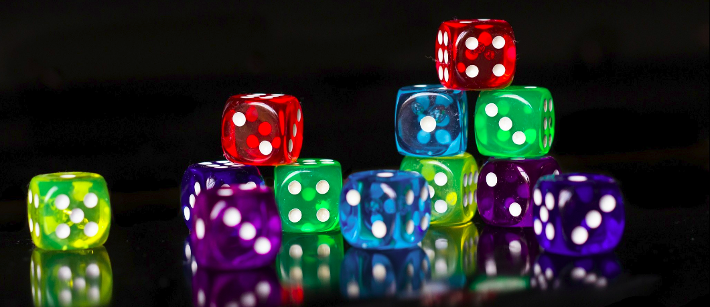

# DiceGame

How To Play in this Game  ?

- When the player throws the start, if he performs the same result twice successively then he receives 20 Points (one increments its score by 20 points).

- For each game play the player is entitled to 20 Launched.

This game use Random function in java 

#How The function Random works ?

- The java.util.Random class implements what is generally called a linear congruential generator (LCG). An LCG is essentially a formula of the following form:

- numberi+1 = (a * numberi + c) mod m

- In other words, we begin with some start or "seed" number which ideally is "genuinely unpredictable",and which in practice is "unpredictable enough". For example, the number of milliseconds— or even nanoseconds— since the computer was switched on is available on most systems.

- Then, each time we want a random number, we multiply the current seed by some fixed number, a, add another fixed number, c, then take the result modulo another fixed number, m. The number a is generally large. This method of random number generation goes back pretty much to the dawn of computing1. Pretty much every "casual" random number generator you can think of— from those of scientific calculators to 1980s home computers to currentday C and Visual Basic library functions— uses some variant of the above formula to generate its random numbers. 

